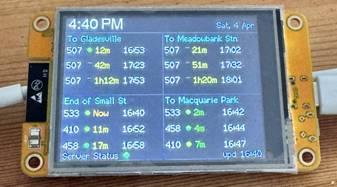
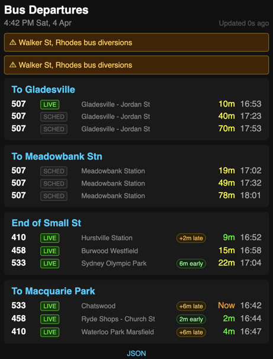
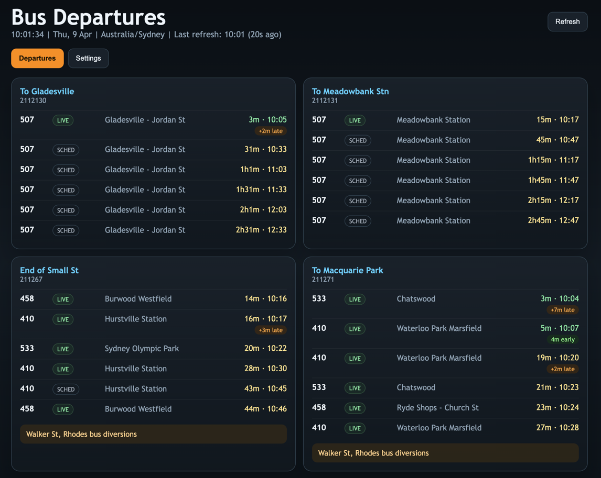
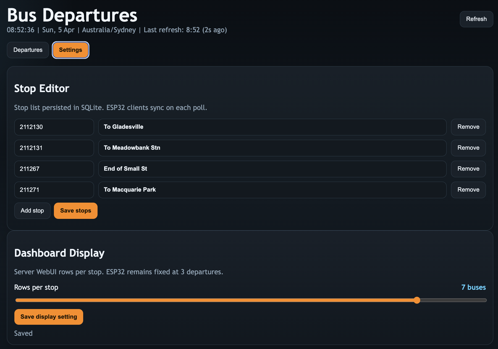

# NSW BusStop

A real-time Sydney bus departure display system built around the **Transport for
NSW Trip Planner API**. A small FastAPI server polls TfNSW every 90 seconds and
serves a normalised JSON feed to an ESP32 CYD (Cheap Yellow Display) that shows
the next three departures for four configured stops on its TFT screen, while
the server WebUI can be configured to show 1 to 8 departures per stop.

```
[TfNSW API] → [FastAPI server on NAS :8081] → [ESP32 client · CYD TFT]
                       ↑                                ↑
               (stop config,                  (dashboard mirror,
                polling, JSON                  device config at
                normalisation)                 http://cyd-busstop.local/)
```

The client is a **thin client** — all TfNSW authentication, polling, caching,
alert handling, real-time flag extraction, and timezone conversion happen on
the server. The ESP32 just fetches pre-processed JSON and renders it.

---

## Screenshots

### ESP32 TFT device



2x2 stop layout on the CYD 2.8" screen: time/date header, per-stop departures
with compact `LIVE` / `SCH` labels, footer server-status dot and `upd HH:MM`.

### Client device dashboard (mirror)



Browser view served directly by the ESP32 at its LAN IP. Mirrors the currently
cached state — useful for checking what the device is actually rendering and
for editing the NAS server URL from the `/config` page.

### Server dashboard



Canonical live dashboard served by the FastAPI container on the NAS. Source of
truth for the stop list and departure data the client consumes.

### Server stop editor



Server-side stop editor on the **Settings** tab. Add, rename, or replace the
configured stop IDs; changes are persisted to SQLite and feed the next
`/api/state` response. The server WebUI also supports a persisted 1 to 8
rows-per-stop display slider while the ESP32 remains fixed at 3 departures.
Client stop editing has been removed — all stop configuration lives on the
server.

---

## Features

- **Live TfNSW data** — real-time bus departures, delay reporting, destination,
  service-alert subtitles
- **Day-aware display** — "Now", `5m`, `1h5m`, or a 3-letter day abbreviation
  (`Mon`, `Tue`, …) for non-today departures
- **Real-time vs scheduled** — compact `LIVE` / `SCH` labels on the TFT and
  badges on the WebUI
- **Resilient cached display** — cached departures keep counting down locally
  when the server is briefly unreachable or the NAS reports upstream TfNSW
  errors such as rate limiting; TFT footer shows a red dot when the last poll
  failed
- **Server-side stop management** — edit the configured stops from the server
  dashboard; the ESP32 mirrors the list on its next poll
- **Configurable server WebUI rows** — choose 1 to 8 departures per stop on
  the server dashboard; the ESP32 `/api/state` feed stays fixed at 3 for
  compatibility
- **Device config page** — edit the NAS URL on the ESP32 from its own `/config`
  page; see live system stats (uptime, WiFi RSSI, heap, build, etc.)
- **Docker-native server** — runs as a single container on a Synology DS423+
  via Container Manager; SQLite persisted in a Docker named volume
- **Optional Bearer-token auth** — shared `NAS_API_KEY` between server and
  client protects `/api/state`; disabled by default for simple LAN use

---

## Components

### Server (`server/`)

Python/FastAPI application. Polls TfNSW, stores stop configuration in SQLite,
serves a web dashboard + JSON API. The server dashboard supports a persisted 1
to 8 departures-per-stop setting. Runs as a Docker container.

- **Tech:** Python 3.12, FastAPI, SQLModel, SQLite, httpx, Jinja2
- **Port:** 8081
- **Details:** [server/README.md](server/README.md)

### Client (`client/`)

ESP32 Arduino firmware for the CYD 2.8" TFT. Fetches JSON from the server and
renders a 2x2 grid of bus stop panels with live countdowns. The ESP32 remains
fixed at 3 departures per stop even when the server WebUI is configured higher.

- **Tech:** ESP32 Arduino, TFT_eSPI, ArduinoJson, ezTime, ESPAsyncWebServer
- **Hardware:** ESP32-2432S028R (CYD 2.8"), ILI9341 240x320
- **Details:** [client/README.md](client/README.md)

---

## Cross-Component JSON Contract

`GET /api/state` is the single interface between server and client:

```json
{
  "time": "10:30:00", "date": "Fri, 4 Apr",
  "now": 1743742200, "tzOff": 36000,
  "lastRefresh": "2026-04-04T10:30:00+10:00",
  "lastError": null,
  "stops": [
    {
      "id": "2112130",
      "name": "To Gladesville",
      "valid": true,
      "fetch_age": 45,
      "alert": "",
      "departures": [
        {
          "route": "500", "clock": "10:35", "minutes": 5,
          "epoch": 1743742500, "rt": true, "delay": 120,
          "dest": "Circular Quay"
        }
      ]
    }
  ]
}
```

Any change to this schema requires a coordinated update across both components.

---

## Quick Start

### 1. Server (on NAS)

```bash
# Copy server/ to your NAS (see deployment guide below)
cp server/.env.example server/app/.env
# Edit server/app/.env — add your TfNSW API key
# Build and start via Synology Container Manager
```

### 2. Client (on Mac)

```bash
# Open nsw-busstop.code-workspace in VSCode
cp client/include/secrets.h.example client/include/secrets.h
# Edit secrets.h with your WiFi credentials (optional — can use captive portal)
pio run -d client/ -t upload
```

### 3. First boot

1. Connect to the `CYD-BusStop` WiFi AP from your phone
2. Enter your WiFi credentials in the captive portal
3. Device connects, syncs time, fetches bus data from the server
4. If the server is not at the default `http://192.168.1.100:8081`, open
   `http://cyd-busstop.local/config` and change the NAS URL

---

## Synology DS423+ Deployment Guide

### Prerequisites

- Synology DS423+ with **Container Manager** package installed
- TfNSW API key from [opendata.transport.nsw.gov.au](https://opendata.transport.nsw.gov.au)
- NAS accessible on your local network (e.g. `192.168.1.100`)

### Step 1: Copy server files to NAS

1. On your Mac, open **Finder** > **Go** > **Connect to Server**
2. Enter `smb://<your-nas-ip>` (e.g. `smb://192.168.1.100`)
3. Navigate to a shared folder (e.g. `docker/`)
4. Create a new folder: `nsw-busstop-server`
5. Copy the **contents** of the `server/` directory into it:
   ```
   nsw-busstop-server/
   ├── app/
   ├── Dockerfile
   ├── docker-compose.yml
   ├── requirements.txt
   └── .env.example
   ```

**Important:** Copy only the contents of `server/`, not the entire monorepo.

### Step 2: Configure environment

1. On the NAS, copy `.env.example` to `app/.env`
2. Edit `app/.env` with your settings:

```env
TFNSW_API_KEY=your-tfnsw-api-key-here
AUTH_ENABLED=false
APP_USERNAME=admin
APP_PASSWORD=your-secure-password
SESSION_SECRET=a-long-random-string
NAS_API_KEY=
TIMEZONE=Australia/Sydney
POLL_INTERVAL_SECONDS=90
PORT=8081
```

The `app/.env` file lives **only on the NAS** — it is never committed to git.

### Step 3: Build and start (Container Manager)

1. Open **Container Manager** on your Synology DSM
2. Go to **Project** > **Create**
3. Set project name: `nsw-busstop-server`
4. Set path: select the `nsw-busstop-server` folder on the NAS
5. Container Manager will auto-detect the `docker-compose.yml`
6. Click **Build & Start**
7. Wait for the build to complete (first build takes 1-2 minutes)
8. Verify: open `http://<nas-ip>:8081` in your browser

You should see the bus departure dashboard. Configure your stops from the
**Settings** tab.

### Updating after code changes

1. On your Mac, pull the latest changes: `git pull`
2. Copy the updated `server/` files to the NAS folder (same Finder method)

   **Do NOT overwrite `app/.env`** — it contains your secrets and is the source
   of truth on the NAS.

3. In Container Manager: **Project** > `nsw-busstop-server` > **Action** > **Build**
4. Container Manager rebuilds the image and restarts the container
5. Stop configuration and database are preserved (Docker named volume)

### Using rsync (advanced)

```bash
rsync -av --exclude 'app/.env' --exclude '__pycache__' --exclude 'data/' \
  server/ admin@<nas-ip>:/volume1/docker/<path>/nsw-busstop-server/
```

Then SSH in and rebuild:

```bash
ssh admin@<nas-ip>
cd /volume1/docker/<path>/nsw-busstop-server
sudo docker compose up -d --build
```

### Data persistence

The SQLite database lives in a Docker **named volume** (`nsw-busstop-data`)
that persists across container rebuilds. Stop configuration survives updates.

**Backup the database:**
```bash
docker cp nsw-busstop-server:/app/data/busstop.db ./busstop-backup.db
```

**Reset all data** (removes stop config — re-seeds with defaults):
```bash
docker volume rm nsw-busstop-data
# Then rebuild the container
```

### Environment variable reference

| Variable                | Required | Default            | Purpose                       |
|:------------------------|:---------|:-------------------|:------------------------------|
| `TFNSW_API_KEY`         | Yes      | —                  | TfNSW Trip Planner API key    |
| `AUTH_ENABLED`          | No       | `false`            | Enable dashboard login        |
| `APP_USERNAME`          | No       | `admin`            | Dashboard username            |
| `APP_PASSWORD`          | Yes\*    | `change-me`        | Dashboard password            |
| `SESSION_SECRET`        | Yes\*    | —                  | Cookie signing secret         |
| `NAS_API_KEY`           | No       | (empty)            | Bearer token for ESP32 client |
| `TIMEZONE`              | No       | `Australia/Sydney` | Display timezone              |
| `POLL_INTERVAL_SECONDS` | No       | `90`               | TfNSW fetch interval          |
| `PORT`                  | No       | `8081`             | Server port                   |

\* Required when `AUTH_ENABLED=true`.

### Troubleshooting

| Symptom                        | Fix                                                    |
|:-------------------------------|:-------------------------------------------------------|
| Container won't start          | Check `app/.env` exists and `TFNSW_API_KEY` is set     |
| Dashboard shows no departures  | Verify API key is valid at the TfNSW Open Data portal  |
| Port conflict                  | Edit `docker-compose.yml` to change the host port      |
| ESP32 shows HTTP 401           | Set `AUTH_ENABLED=false`, or set matching `NAS_API_KEY` / `SECRET_NAS_API_KEY` values |
| "Bind mount failed"            | Ensure named volume is used (default docker-compose.yml) |
| Stops reset after rebuild      | Normal if volume was deleted; reconfigure in dashboard  |

---

## Secrets

| Secret            | Location                              | Purpose                       |
|:------------------|:--------------------------------------|:------------------------------|
| TfNSW API key     | `server/app/.env` (NAS only)          | TfNSW Trip Planner API access |
| Dashboard creds   | `server/app/.env` (NAS only)          | Server dashboard login        |
| NAS API key       | `server/app/.env` + `client/include/secrets.h` | Shared Bearer token for `/api/state` |
| WiFi credentials  | `client/include/secrets.h`            | WiFiManager seed              |

Templates: `server/.env.example` (copy to `server/app/.env`) and
`client/include/secrets.h.example`. Both `.env` and `secrets.h` are gitignored.

---

## Repository Structure

```
nsw-busstop/
├── client/                       # ESP32 PlatformIO project
│   ├── platformio.ini
│   ├── partitions_custom.csv
│   ├── include/                  # config.h, debug.h, secrets.h
│   ├── src/                      # main.cpp, display, bus_api, etc.
│   ├── CHANGELOG.md
│   └── README.md
│
├── server/                       # Python FastAPI server
│   ├── Dockerfile
│   ├── docker-compose.yml
│   ├── requirements.txt
│   ├── .env.example
│   ├── app/                      # FastAPI application
│   └── README.md
│
├── images/                       # Screenshots used in this README
├── README.md                     # This file
├── CLAUDE.md                     # AI assistant context
└── nsw-busstop.code-workspace    # VSCode multi-root workspace
```

---

## Development Setup

1. Clone the repo: `git clone https://github.com/anthonyjclarke/nsw-busstop.git`
2. Open `nsw-busstop.code-workspace` in VSCode
3. PlatformIO auto-detects the client project via workspace settings

### Server (local dev)

```bash
cd server
cp .env.example app/.env
# Edit app/.env with your TfNSW API key
pip install -r requirements.txt
uvicorn app.main:app --reload --port 8081
```

### Client

```bash
cp client/include/secrets.h.example client/include/secrets.h
# Edit secrets.h with your WiFi credentials
pio run -d client/ -t upload
```

---

## Licence

Personal project — not licensed for redistribution.
