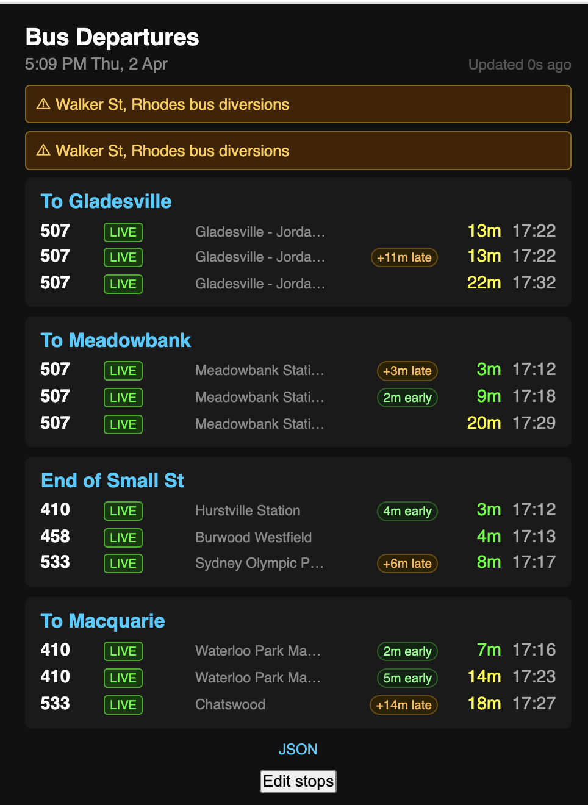
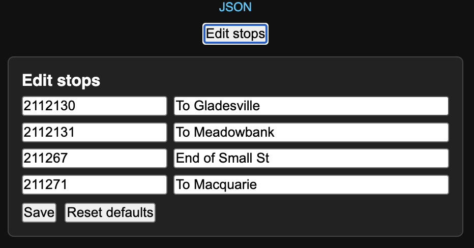

# CYD_BusStop_NSW

ESP32 bus stop notifier for the **ESP32-2432S028R (CYD 2.8")** displaying live NSW bus departures for four configurable stops near Ryde/Putney. Built with PlatformIO and the Arduino framework.

---

## What It Does

- Fetches the next 3 departures per stop from the TfNSW Trip Planner API
- Displays all four stops simultaneously in a 2×2 grid (landscape 320×240)
- TFT shows route · real-time indicator (`●`/`~`) · minutes/day label · clock time
- WebUI shows route · `LIVE`/`SCHED` badge · destination · delay pill · minutes/day label · clock time
- Departures sorted by estimated time — soonest first
- Non-today departures show a day abbreviation (Mon, Tue, etc.) instead of minutes
- Late/early bus indicators on WebUI (e.g. "+4m late", "3m early")
- Service alert banner on WebUI when TfNSW returns disruption info
- Live time and date header, updated every second via NTP
- Web interface at the device IP: live dashboard, JSON state API, stop editor

---

## Hardware

| Component  | Detail                               |
|:-----------|:-------------------------------------|
| Board      | ESP32-2432S028R (CYD 2.8")           |
| Display    | ILI9341 · 240×320 · SPI              |
| Touch      | XPT2046 (unused in this project)     |
| Flash      | 4 MB · custom partition table        |
| USB–Serial | CP2102                               |

---

## Prerequisites

### TfNSW API Key

This project uses the **TfNSW Open Data Trip Planner API** (Departure Monitor endpoint).

1. Register at [opendata.transport.nsw.gov.au](https://opendata.transport.nsw.gov.au)
2. Sign in and go to **My Account → Applications → Add Application**
3. Give the application a name (e.g. `CYD BusStop`) and request access to the
   **Trip Planner APIs** product
4. Once approved (usually instant), copy the API key from the application detail page
5. Paste it into `include/secrets.h` as `SECRET_TFNSW_API_KEY` (see [Configuration](#configuration))

The key is sent as an HTTP header: `Authorization: apikey <your-key>`.
Requests are made to:

```
https://api.transport.nsw.gov.au/v1/tp/departure_mon
```

The free tier allows sufficient polling for personal/hobbyist use at the 60 s
interval used here.

### Toolchain

- [PlatformIO](https://platformio.org/) (VS Code extension or CLI)
- Libraries are fetched automatically on first build via `lib_deps` in `platformio.ini`

---

## Project Structure

```
CYD_BusStop_NSW/
├── platformio.ini             # Board, framework, libs, TFT build flags
├── partitions_custom.csv      # 4 MB flash layout with OTA slots
├── include/
│   ├── config.h               # Stop IDs, API constants, display defaults
│   ├── debug.h                # Leveled DBG_* macros with wall-clock timestamps
│   └── secrets.h              # Gitignored — WiFi + API credentials
└── src/
    ├── main.cpp               # setup(), loop(), init orchestration
    ├── display.cpp/.h         # TFT drawing — header, panels, status bar
    ├── bus_api.cpp/.h         # TfNSW API fetch, parse, sort departures
    ├── config.cpp             # Stop config NVS persistence
    ├── time_mgr.cpp/.h        # ezTime NTP init, time/date/day helpers
    └── web_server.cpp/.h      # AsyncWebServer routes, WebUI, JSON API
```

---

## Configuration

### `include/secrets.h` (gitignored — create before first build)

```cpp
#pragma once
#define SECRET_WIFI_SSID     "your-ssid"
#define SECRET_WIFI_PASS     "your-password"
#define SECRET_TFNSW_API_KEY "your-tfnsw-api-key"
```

### `include/config.h`

Key tuneable constants:

| Constant             | Default              | Purpose                      |
|:---------------------|:---------------------|:-----------------------------|
| `POLL_INTERVAL_MS`   | `60000`              | Bus API refresh interval     |
| `BRIGHTNESS_DEFAULT` | `200`                | Backlight (0–255)            |
| `TIME_24HR_DEFAULT`  | `false`              | 12 hr display                |
| `WIFI_AP_NAME`       | `"CYD-BusStop"`      | Captive portal AP name       |
| `OTA_HOSTNAME`       | `"cyd-busstop"`      | mDNS + ArduinoOTA hostname   |

---

## Stop Configuration

Default stops are defined in `include/config.h`:

| Stop ID | Display Name      |
|:--------|:------------------|
| 2112130 | To Gladesville    |
| 2112131 | To Meadowbank Stn |
| 211267  | End of Small St   |
| 211271  | To Macquarie Park |

At runtime, the active stop list is stored in NVS and can be edited from the WebUI.
Use the "Edit stops" pane on `/` to update stop IDs and display names, or reset back
to the defaults above.

---

## Building & Flashing

```bash
# Build
pio run

# Flash via USB
pio run --target upload

# Flash via OTA
pio run --target upload --upload-port cyd-busstop.local

# Monitor serial output
pio device monitor
```

Upload speed is set to 230400 baud. Port is auto-detected by PlatformIO.

---

## First Boot

1. Power on — the display shows `Connecting WiFi...`
2. Connect to the `CYD-BusStop` AP from your phone or computer
3. Complete the captive portal with your WiFi credentials
4. The device connects, syncs time, fetches buses, and draws the display

If `SECRET_WIFI_SSID` / `SECRET_WIFI_PASS` are set in `secrets.h`, the portal
is pre-filled and the device connects automatically if credentials are valid.

---

## Display Layout

### TFT Dashboard


The 2×2 grid shows four stops simultaneously. Each departure row displays:
route number, real-time indicator (`●` green = GPS-tracked, `~` grey = scheduled),
minutes until arrival (green <10 min, yellow >=10 min, orange = Now), and clock time.
Non-today departures show a day abbreviation (Mon, Tue, etc.) in grey.
The footer shows the last successful API fetch time.

### WebUI Dashboard



The web interface adds destination names, `LIVE`/`SCHED` badges, delay pills
(orange for late, green for early), and service alert banners.

### WebUI Stop Editor



The "Edit stops" pane allows runtime changes to stop IDs and display names.
Changes are persisted to NVS and trigger an immediate data refresh.

---

## Web Interface

| Route              | Purpose                                      |
|:-------------------|:---------------------------------------------|
| `/`                | Live dashboard + stop editor                 |
| `/api/state`       | JSON — time, date, epoch, TZ offset, stops   |
| `/api/stops`       | JSON — current runtime stop config           |
| `/api/stops/reset` | POST — restore default stop configuration    |
| `/mirror`          | Redirects to `/`                             |

Access via the device IP shown in serial output, or `http://cyd-busstop.local/`
if your network supports mDNS.

### WebUI Features

- Per-departure `LIVE` or `SCHED` badge based on real-time tracking status
- Destination name for each departure (e.g. "Gladesville - Jordan St")
- Delay pill: `+4m late` (orange) or `3m early` (green), suppressed below 2 min
- Day abbreviation for non-today departures instead of minutes
- Alert banner when TfNSW returns service disruption text
- "Edit stops" pane to update persisted stop IDs and names
- Auto-refresh: API poll every 15s, client-side recalc every 5s

---

## OTA Updates

**ArduinoOTA** — upload directly from PlatformIO during development:
```bash
pio run --target upload --upload-port cyd-busstop.local
```

---

## Debug Output

Set `DEBUG_LEVEL` in `platformio.ini` build_flags:

| Level | Macro          | Output                         |
|:------|:---------------|:-------------------------------|
| 1     | `DBG_ERROR`    | Critical failures              |
| 2     | `DBG_WARN`     | Unexpected but recoverable     |
| 3     | `DBG_INFO`     | State changes, init (default)  |
| 4     | `DBG_VERBOSE`  | Frequent events, values        |

Debug lines include a wall-clock timestamp after NTP sync, or uptime before sync:

```text
[15:05:24] [INFO]  fetchStop[0] chunked, heap: 157152, maxBlk: 102388
[15:05:25] [INFO]  Stop To Gladesville — 3 departure(s):
[15:05:25] [INFO]    [1] Route 507     3m  15:09  RT  delay:+4m  Gladesville - Jordan St
```

---

## Roadmap

- **Phase 1** ✓: WiFi · NTP · TfNSW API · TFT display layout · OTA
- **Phase 2** ✓ (partial): Web dashboard · NVS stop persistence · live stop
  editor · real-time indicators · delay/destination/alert display · day labels
- **Phase 2** (remaining): 12/24 hr toggle · brightness control · full config page
- **Phase 3**: Canvas display mirror at `/mirror` · font upgrade to VLW NotoSans

---

## Licence

Personal project — not licensed for redistribution.
