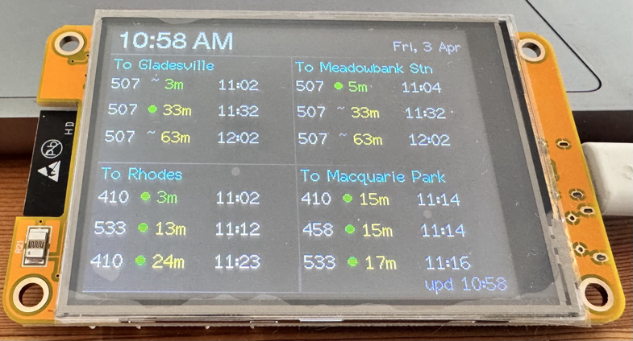

# CYD_BusStop_NSW Client

ESP32 bus departure display for the **ESP32-2432S028R (CYD 2.8")**. This is the
**client** component of the [nsw-busstop](../README.md) system — it fetches
pre-processed bus data from the companion [server](../server/) and renders it on
the TFT.

**The server must be running on your local network for this device to show bus data.**

---

## What It Does

- Displays the next 3 bus departures for up to 4 NSW stops on a 2x2 TFT grid
- Fetches JSON from the NAS server (`/api/state`) every 60 seconds
- Live countdowns recalculated every 15 seconds from stored epoch
- Real-time indicators: green dot = GPS-tracked, grey tilde = scheduled
- "Now" label for imminent buses, day abbreviation for non-today departures
- Live time/date header updated every second via NTP
- Device WebUI for cached state view and stop configuration

---

## Hardware

| Component  | Detail                               |
|:-----------|:-------------------------------------|
| Board      | ESP32-2432S028R (CYD 2.8")           |
| Display    | ILI9341, 240x320, SPI               |
| Touch      | XPT2046 (unused in this project)     |
| Flash      | 4 MB, custom partition table         |
| USB-Serial | CP2102                               |

---

## Setup

### 1. Create secrets file

```bash
cp include/secrets.h.example include/secrets.h
```

Edit `include/secrets.h` with your WiFi credentials and (optionally) the NAS API key.

### 2. Build and flash

```bash
# From this directory:
pio run -t upload        # Flash firmware

# Or from the monorepo root:
pio run -d client/ -t upload
```

Upload speed: 230400 baud. Port: auto-detected.

### 3. First boot

1. Connect to the `CYD-BusStop` WiFi AP from your phone
2. Enter your WiFi credentials in the captive portal
3. Device connects, syncs time, and fetches bus data from the server
4. Access device WebUI at the displayed IP to configure NAS URL if needed

### 4. OTA updates

```bash
pio run -t upload --upload-port cyd-busstop.local
```

---

## Configuration (`include/config.h`)

| Constant             | Default                       | Purpose                |
|:---------------------|:------------------------------|:-----------------------|
| `NAS_DEFAULT_URL`    | `"http://192.168.1.100:8081"` | Default server URL     |
| `POLL_INTERVAL_MS`   | `60000`                       | NAS fetch interval     |
| `BRIGHTNESS_DEFAULT` | `200`                         | Backlight (0-255)      |
| `TIME_24HR_DEFAULT`  | `false`                       | 12hr clock display     |
| `WIFI_AP_NAME`       | `"CYD-BusStop"`               | Captive portal AP name |
| `OTA_HOSTNAME`       | `"cyd-busstop"`               | mDNS + OTA hostname    |

---

## Project Structure

```
client/
├── platformio.ini
├── partitions_custom.csv
├── include/
│   ├── config.h               # Tuneable constants
│   ├── debug.h                # Leveled DBG_* macros
│   ├── secrets.h              # Gitignored — WiFi + NAS API key
│   └── secrets.h.example      # Template for secrets.h
├── src/
│   ├── main.cpp               # setup(), loop(), init orchestration
│   ├── display.cpp/.h         # TFT drawing — header, panels, status bar
│   ├── bus_api.cpp/.h         # NAS fetch, JSON parse, data structs
│   ├── config.cpp             # Stop + NAS URL NVS persistence
│   ├── time_mgr.cpp/.h        # ezTime NTP, time/date/day helpers
│   ├── web_server.cpp/.h      # AsyncWebServer, device config API
│   └── debug.cpp              # Wall-clock timestamp for debug output
```

---

## Device Web Interface

Access at the device's IP address or `http://cyd-busstop.local/`.

| Method | Path               | Description                                |
|:-------|:-------------------|:-------------------------------------------|
| GET    | `/`                | Live local dashboard + stop editor         |
| GET    | `/api/state`       | Cached NAS data with current countdowns    |
| GET    | `/api/stops`       | Current stop configuration                 |
| POST   | `/api/stops`       | Replace stop ids/names and queue refresh   |
| POST   | `/api/stops/reset` | Restore default stop ids/names             |

---

## Display Layout



Landscape 320x240. Header bar with time and date, then 2x2 grid of stop panels.
Each panel shows the stop name and up to 3 departure rows with route number,
real-time indicator, countdown, and clock time.

Footer shows `upd HH:MM` for the last successful NAS fetch. If the NAS becomes
unreachable, the footer prepends `SERVER OFFLINE` in red while the client keeps
aging the cached countdowns locally.

---

## Debug Output

Set `DEBUG_LEVEL` in `platformio.ini` build flags (default: 3):

| Level | Macro        | Output                     |
|:------|:-------------|:---------------------------|
| 1     | `DBG_ERROR`  | Critical failures          |
| 2     | `DBG_WARN`   | Unexpected but recoverable |
| 3     | `DBG_INFO`   | State changes, init        |
| 4     | `DBG_VERBOSE`| Frequent events, values    |

```text
[15:05:24] [INFO]  Stop 'To Gladesville' — 3 departure(s):
[15:05:24] [INFO]    [1] Route 507     3m  15:09  RT  delay:+4m  Gladesville - Jordan St
```

---

## Licence

Personal project — not licensed for redistribution.
